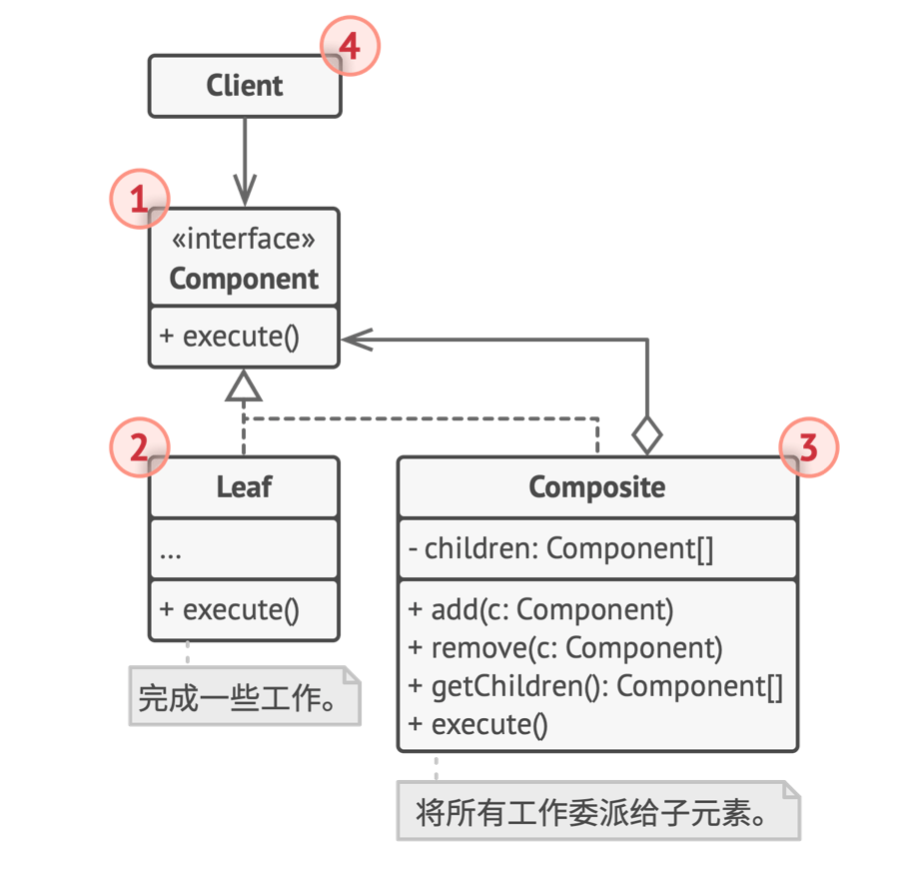

# 组合模式

**组合** 是一种结构型设计模式， 你可以使用它将对象组合成树状结构，并且能像使用独立对象一样使用它们。

## 结构

1. **组件** (Component)接口描述了树中简单项目和复杂项目所 共有的操作。
2. **叶节点** (Leaf)是树的基本结构，它不包含子项目。
3. **容器** (Composite)——又名“组合(Composite)”——是包含叶 节点或其他容器等子项目的单位。 容器不知道其子项目所属 的具体类， 它只通过通用的组件接口与其子项目交互。
4. **客户端** (Client)通过组件接口与所有项目交互。因此，客 户端能以相同方式与树状结构中的简单或复杂项目交互。

## 适合应用场景

- 如果你需要实现树状对象结构，可以使用组合模式

  组合模式为你提供了两种共享公共接口的基本元素类型: 简 单叶节点和复杂容器。 容器中可以包含叶节点和其他容器。 这使得你可以构建树状嵌套递归对象结构。

- 如果你希望客户端代码以相同方式处理简单和复杂元素，可
  以使用该模式

  组合模式中定义的所有元素共用同一个接口。 在这一接口的 帮助下， 客户端不必在意其所使用的对象的具体类。

## 实现方式

1. 确保应用的核心模型能够以树状结构表示。 尝试将其分解为简单元素和容器。 记住， 容器必须能够同时包含简单元素和 其他容器。
2. 声明组件接口及其一系列方法， 这些方法对简单和复杂元素都有意义。
3. 创建一个叶节点类表示简单元素。 程序中可以有多个不同的 叶节点类。
4. 创建一个容器类表示复杂元素。 在该类中，创建一个数组成 员变量来存储对于其子元素的引用。该数组必须能够同时保 存叶节点和容器，因此请确保将其声明为组合接口类型。

   实现组件接口方法时， 记住容器应该将大部分工作交给其子 元素来完成。

5. 最后， 在容器中定义添加和删除子元素的方法。

## 优缺点

- 你可以利用多态和递归机制更方便地使用复杂树结构。
- 开闭原则。 无需更改现有代码， 你就可以在应用中添加新元 素， 使其成为对象树的一部分。
- 对于功能差异较大的类， 提供公共接口或许会有困难。 在特定情况下， 你需要过度一般化组件接口， 使其变得令人难以理解。
